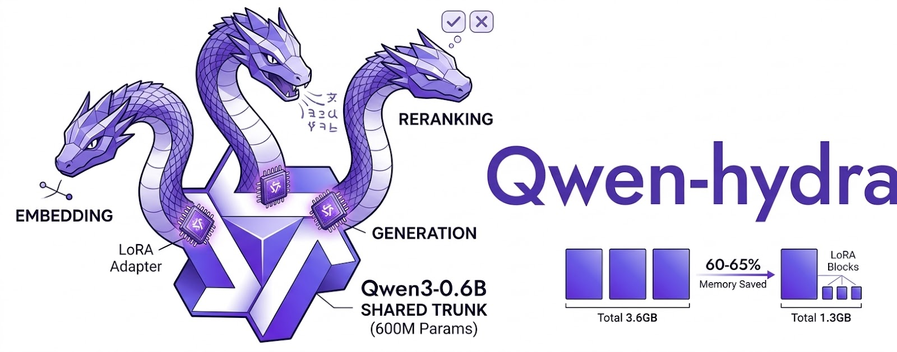

# Qwen-Hydra 🐉



**One trunk, three heads.** Load Qwen3-0.6B once, hot-swap weight deltas for embedding, reranking, and generation.

## Why?

Qwen3's embedding and reranker models are LoRA fine-tunes of the same 0.6B base. Loading all three separately costs ~3.6 GB. Qwen-Hydra extracts the tiny weight deltas and swaps them on demand — **~1.3 GB total** instead of 3.6 GB.

## Quick Start

```bash
pip install -e .

# Step 1: Extract deltas from HuggingFace models (one-time, downloads ~3.6 GB)
qwen-hydra extract --output ./deltas

# Step 2: Use the hydra
python -c "
from qwen_hydra import QwenHydra

hydra = QwenHydra.from_extracted('./deltas')

# Embed
vecs = hydra.embed(['search query', 'document text'])

# Rerank
scores = hydra.rerank('search query', ['doc A', 'doc B'])

# Generate
text = hydra.generate('Tell me about Beijing', max_new_tokens=128)
print(text)
"
```

## Architecture

```
┌─────────────────────────────────┐
│        Qwen3-0.6B Base          │
│    28 layers · 1024 hidden      │
│    16 QH · 8 KVH · SwiGLU      │
│         (~1.2 GB bf16)          │
├─────────────────────────────────┤
│  Delta Swap Layer               │
│  ┌─────────┬──────────┬───────┐ │
│  │ Embed Δ │ Rerank Δ │ Gen Δ │ │
│  │ ~5-20MB │ ~5-20MB  │  0 MB │ │
│  └─────────┴──────────┴───────┘ │
├─────────────────────────────────┤
│  Task Heads                     │
│  ┌─────────┬──────────┬───────┐ │
│  │ Pool+L2 │ Yes/No   │ Next  │ │
│  │ Norm    │ Logits   │ Token │ │
│  └─────────┴──────────┴───────┘ │
└─────────────────────────────────┘
```

## Memory Savings

| Setup | Memory |
|---|---|
| 3x separate models | ~3.6 GB |
| Qwen-Hydra (bf16) | ~1.3 GB |
| Qwen-Hydra (int8) | ~0.7 GB |

## License

MIT
